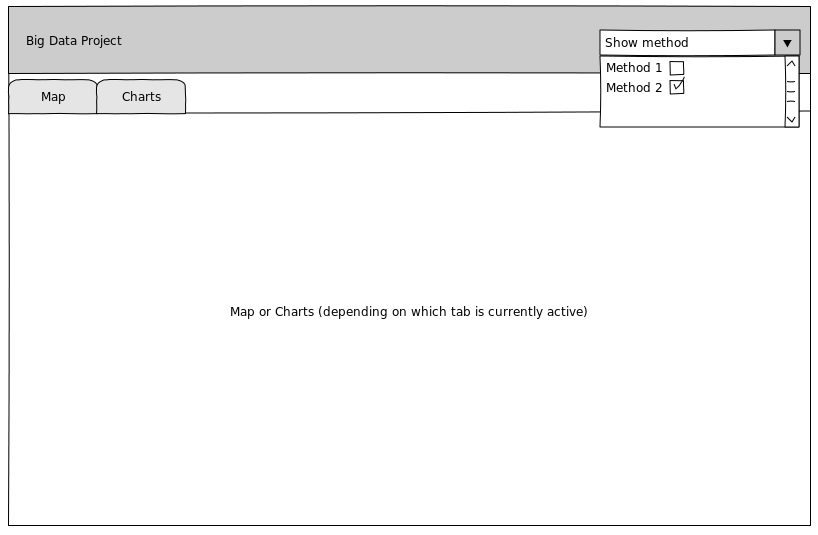

#Big Data Project (COMP530)
##Design Document

###1 Summary of Proposal
###2 Data structures and storage
###3 Algorithms and statistical model
###4 Interface design

####4.1 Visualisation
The outcome of the project is meant to be visualised on a large screen. But throughout development phase, as well as later, for demonstrational purposes, it would be very convenient to have a simpler visualisation method that could be run on any machine.

That is why we intend to create a small web application that allows to see the results of our statistical model (requirement BR_VI_02). The outcome should be drawn on a map and easy to navigate from the browser for any user. The results should be straightforward to read and interpret, with different values (or classes) marked distinctly (for example by varying colours).

Apart from the map, the results can also be drawn as charts, so that a user has a thorough understanding where the probability is high and where it is low. Also, it should be possible to move between the two views (map and charts) smoothly.

If there is more that one statistical method available, there should be an easy way to distinguish the results produced by each method.

Figure 4.1. Sketch of a visualisation website. It shows the most important parts of the application: map and charts (as tabs) and a simple menu to show a list of methods.

To ease our work on the features described above, some additional libraries will be used. We are going to use [*Leaflet*](http://leafletjs.com), a free JavaScript library for working with online maps. To obtain interactive charts, we will use [*D3.js*](http://d3js.org)

For visualising the outcome on Hartree's screens, geo-tagged TIFF images will be created. They should be produced at the end of the execution of a program.

####4.2 Executing the program

As the software that will be created concerns obtaining correct results through use of the statistical model, there is no need for any advanced graphical interface for starting the program. Therefore, the application will be delivered as an executable `jar` file that can be started by writing commands in a Unix terminal. To ease the whole process, some shell scripts might be added as well.

###5 Testing and evaluation
###6 Review against the Plan
