# COMP 530 Big Data Project
####Final Report

### 1 Introduction

#### 1.1 Aim of the project

#### 1.2 Available data sets

#### 1.3 Technologies used

Several different technologies were used to create the system described in this document.
The applications consists of three essential parts. First, all available data is loaded into the Java application. Second, the training set is used to train statistical mode built with Python. Test sets produced in stage 1 are then loaded into Python program to compute probabilities. In the third stage the data set (which includes probabilities now) is loaded into a visualisation website created with Python, HTML and JavaScript. The flow of the application is presented in figure 1.1.

Figure 1.1. Diagram of the whole system.

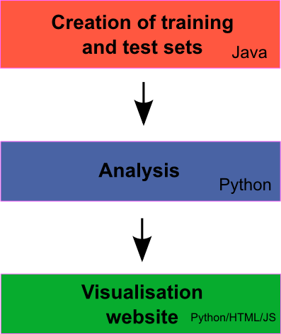

Additionally, there were several libraries and modules which were used in different parts of the application. They are listed in table 1.1.

Table 1.1. A list of libraries used in this project.

|Name|Description|
|----|-----------|
|JUnit|This Java library has been used to write various unit tests of crucial parts of the system. Link: http://junit.org/|
|Pandas|It is a Python library which makes it easier to work with different data sets. It consists of data types which help manipulate the data, and functions which ease the process of loading and saving data. Link: http://pandas.pydata.org/|
|Statsmodels|It is a Python module which consists of a number of statistical models. Logistic regression, among others that were tried, is included in this library. Link: http://statsmodels.sourceforge.net/|
|matplotlib|This Python library was used to plot graphs, used here for visualisation purposes and during development for observing trends and checking if the model is working. Link: http://matplotlib.org/|
|Flask|This small Python web framework was used to create a visualisation website. Link: http://flask.pocoo.org/|
|Leaflet|This JavaScript library was used to enable viewing results on the map. The actual map data comes from OpenStreeMap. Link: http://leafletjs.com/|

#### 1.4 Testing application

During development, it is obviously quite easy to make errors that may be difficult to spot. That may also make the process of development significantly longer, as developers need to take time to debug possibly well-hidden and not so obvious mistakes. That is why during the development stage, test driven development (TDD) was used to create crucial parts of the system, those where any mistake is very costly. So according to the principles of the TDD, developer first creates a test function (which tests a feature that will be implemented later). That approach, although possibly makes development longer, can help avoid serious problems and in the end helps create software with fewer errors. All units tests were created with JUnit library for Java and are listed in table 1.2.

Table 1.2. A list of created unit tests.

|Name|Description|
|----|-----------|
|`testLoading()`|Tests whether all data sets were correctly loaded. The test is performed by checking whether correct number of items is available in the application after the loading phase.|
|`testLanLonConverter()`|Checks whether Grid Reference points are correctly converted to latitude and longitued. Test is performed by comparing known values of latitude and longitude to the converted ones.|
|`testNGR()`|Tests whether National Grid Reference notation is correctly understood by the application. Each NGR value should be divided into three parts: two-letter square symbol and two five-digits numbers.|
|`testOS()`|This tests whether available data concerning the height over the sea level is correctly loaded, by checking if number of values are correct.|
|`testOSData()`|That's additional check for the height data. It tests whether all squares on the map have all data.|
|`testOSMetadata()`|Another test for the height data. It tests whether metadata (ie., number of rows/columns, position on the map etc.) for each square on the map is available.|
|`testOSCoordinates()`|It tests whether location obtained from the height data works correctly. It does so by trying to compare few points from the square to the known values.|
|`testFillZeroes()`|Some values used for location need to be filled with zeros at the beginning. This unit test checks if it is done correctly.|
|`testSquareSymbols()`|This test checks if conversion between 10 km squares and locations values (which can be in range 0 - 99999) works. |
|`testMinDistances()`|Tests if a function which searches for the closest monument or other landmark does so correctly.|
|`testHeightEastingNorthing()`|Checks whether location of some height values is correctly identified.|

### 2 Data

#### 2.1 Preparing training data

#### 2.2 Producing test sets

### 3 Analysis

Analytical part of the application was created in Python using several additional libraries mentioned in table 1.1. Using Java application, the training set is created and saved as a `csv` file. It includes different features, some of which were used during training.

#### 3.1 Selecting features

Training set includes the following columns:

Table 3.1. Features available in the training set.

|Feature|Description|
|-------|-----------|
|`arch`|Denotes whether location is an actual archeological site (value 1) or not (0).|
|`height`|Height over the sea level (in meters).|
|`distM`|Distance to the closest monument.|
|`distP`|Distance to the closest park.|
|`distB`|Distance to the closest historical building.|
|`countM`|Number of monuments within 5 kilometers.|
|`countP`|Number of parks within 5 kilometers.|
|`countB`|Number of historical buildings within 5 kilometers.|
|`e`|Location (using Grid Reference).|
|`n`|Location (using Grid Reference).|
|`lat`|Latitude|
|`lon`|Longitude|

But for the actual analysis the following features were used: `height`, `distM`, `distP`, `distB` and `countP`. `countM` and `countB` were not used, because during tests it turned out that results obtained when using those two features gave worse results. Evaluation was conducted by dividing the training set into two parts. After the training stage (using the first half), the second half was used as a test to compare obtained probabilities with actual known values. Problems with `countB` and `countM` might stem from the fact that the correlation between those two values and the `arch` (which denotes whether the location has an archeological site) was low. This was tested by plotting graphs of different variables to see their relationship visually.

In all graphs below, red colour denotes an actual archeological site, and green lack of thereof. The graphs were plotted using the training data.

##### 3.1.1. Correlation between `height` and features in the training set

Figure 3.1. Relationship between height (Y axis) and the `arch` variable in the training set (X axis). Clearly probability of finding an archeological artifact is inversely proportional to the height over sea level.

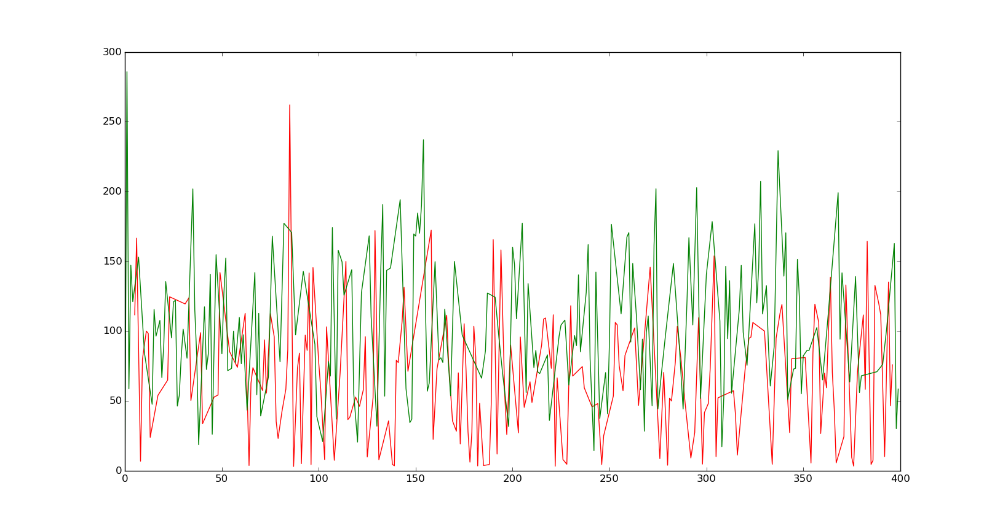

Figure 3.2. Relationship between `height` (Y axis) and `distB` (X axis). Clearly many green dots (no archeological sites) are further away from historical buildings than the red dots (archeological sites).

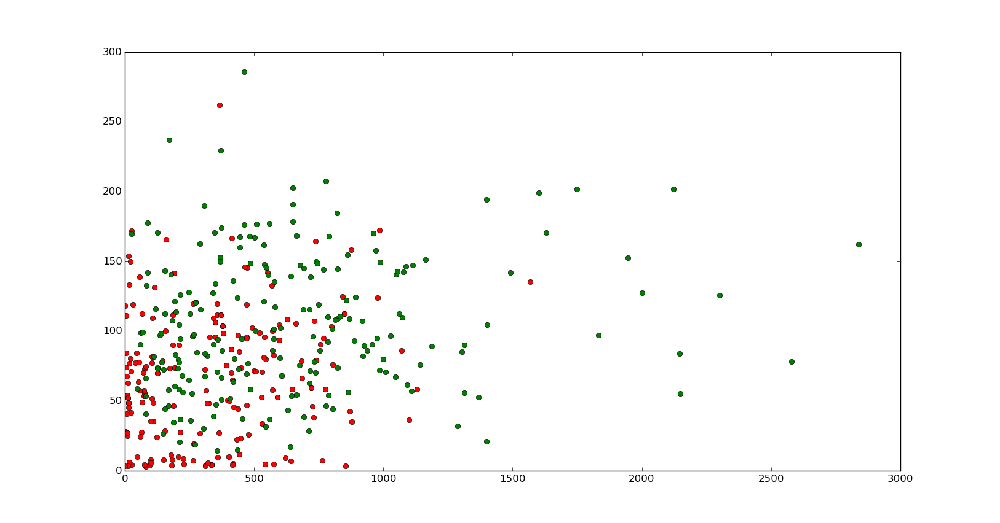

Figure 3.3. Relationship between `height` (Y axis) and `distM` (X axis). Many green dots (no archeological sites) are further away from monuments than the red dots (archeological sites).

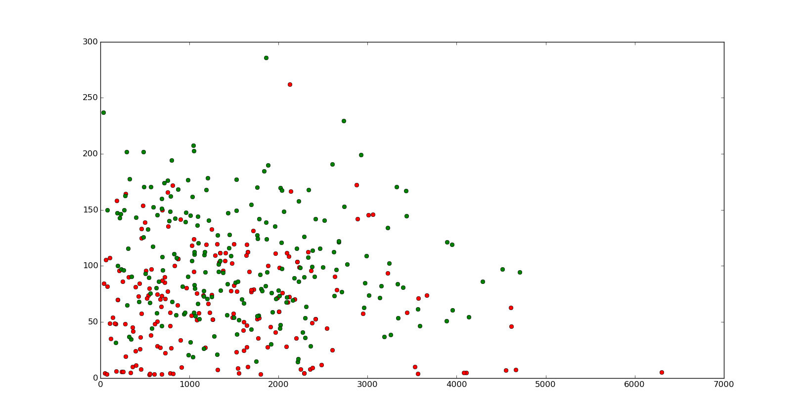

Figure 3.4. Relationship between `height` (Y axis) and `distP` (X axis). Many green dots (no archeological sites) are further away from parks than the red dots (archeological sites).

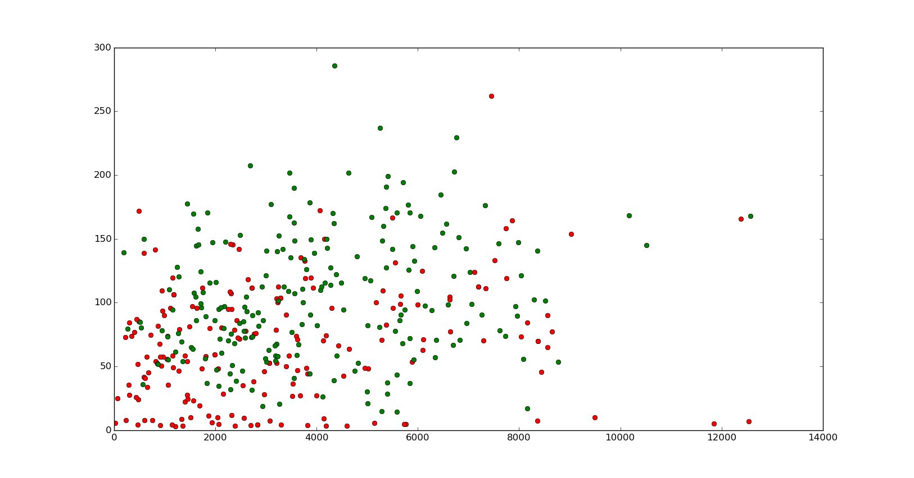

Figure 3.5. Relationship between `height` (Y axis) and `countP` (X axis). More parks usually means larger probability of finding archeological sites (red dots). Often, places with no archeological sites have no parks nearby (ie. within 5 km).

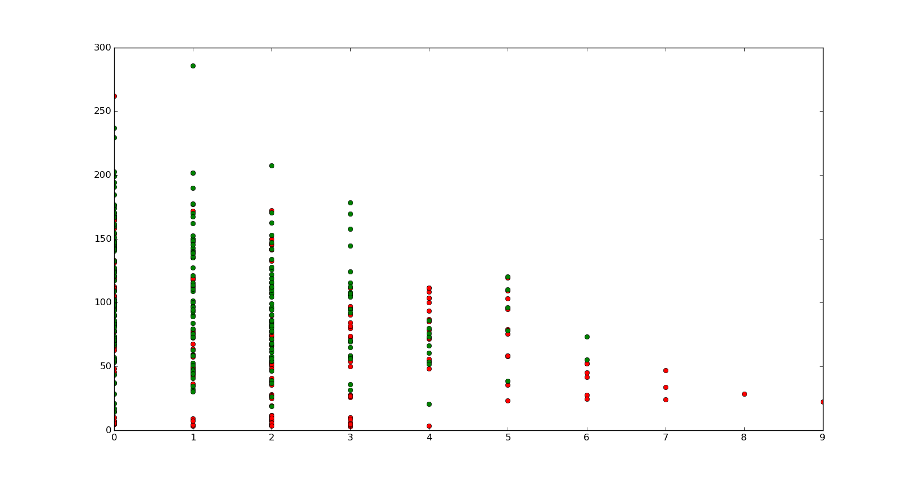

Figure 3.6. Relationship between `height` (Y axis) and `countM` (X axis). Here correlation is not so easily seen. `countM` was eventually not used for the analysis.

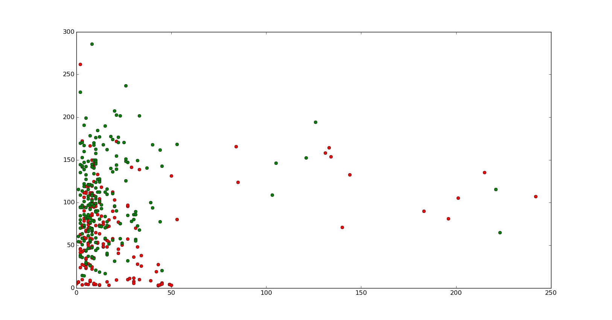

Figure 3.7. Relationship between `height` (Y axis) and `countB` (X axis). Here correlation is not so easily seen. `countB` was eventually not used for the analysis.

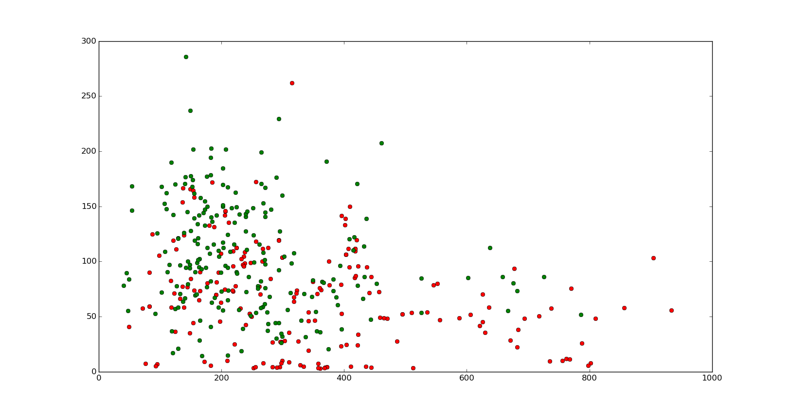

##### 3.1.2. Features

Figure 3.8. `distB` feature (Y axis) in the training data (X axis). Clearly many archeological sites are close to historical buildings.

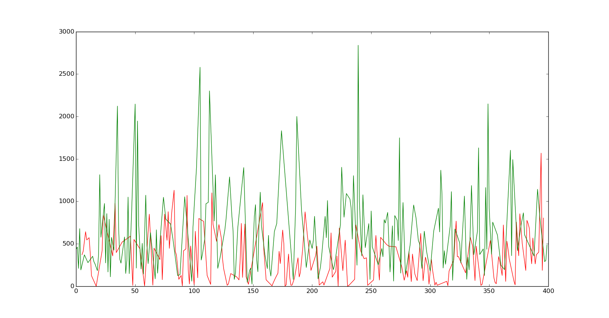

Figure 3.9. `distM` feature (Y axis) in the training data (X axis). More archeological sites are close to monuments, but the relationship is less visible.

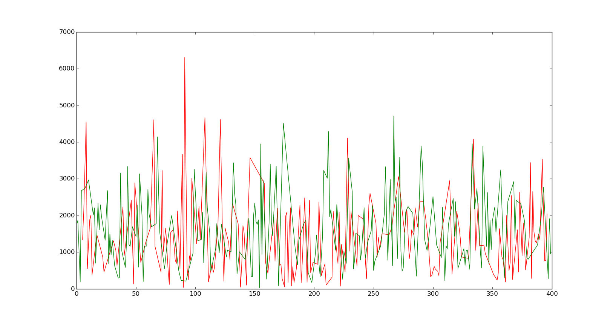

Figure 3.10. `distP` feature (Y axis) in the training data (X axis). More archeological sites are close to parks, but the relationship is less visible.

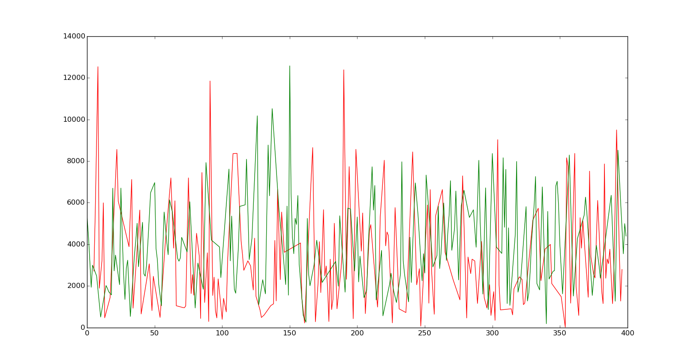

Figure 3.11. `countP` feature (Y axis) in the training data (X axis). Archeological sites generally have many parks nearby.

Figure 3.12. `countM` feature (Y axis) in the training data (X axis). Correlation difficult to spot. Feature was not used.

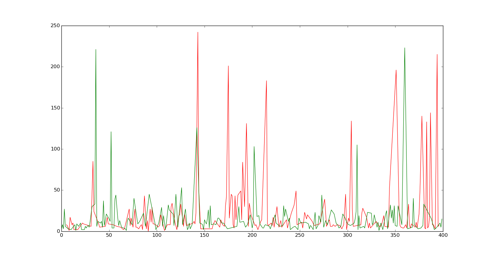

Figure 3.13. `countB` feature (Y axis) in the training data (X axis). Although clearly archeoalogical sites have more buildings nearby, but during the analysis using this feature only made the results worse and that's why it was not used.

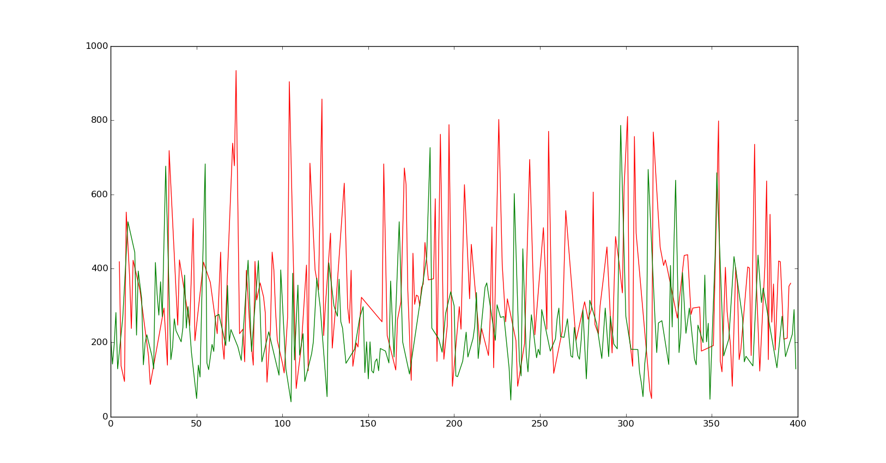

#### 3.2 Testing algorithms

Statsmodels library which was used for the analysis includes several algorithms. Each algorithm was run with the training data (half of those used for training and half for evaluation). Using this technique, values of true positives, true negatives, false positives and false negatives were collected. Finally, the logistic regression was used as it proved to have the highest number of true positives and true negatives. Results of the tests are available in table 3.2. In each test __529__ instances were used.

Table 3.2. Evaluating algorithms

|Algorithm|TP + TN|% of (TP + TN)|TP|TN|FP|FN|
|-----|-----|-----|-----|-----|-----|-----|
|Logistic regression|397|75%|165|232|59|73|
|Negative Binomial Regression|388|73%|155|233|58|81|
|Linear (OLS)|344|65%|116|228|63|119|
|Probit regression|396|74.9%|164|232|59|74|
|Poisson regression|388|73%|155|233|58|81|

### 4 Visualisation

### 5 Conclusions

#### 5.1 Observations

After running the analysis, the graphs were plotted again to see whether obtained probabilities correlate to the selected features from the training data (as was described in the section 3). The results are presented below.

Figure 5.1. Probability of finding an archeological artifact (Y axis) is clearly related to the `height` (X axis). Probability grows as height over sea level decreases. This conclusion coincides with what was observed in figure 3.1 (which was based on the training data).

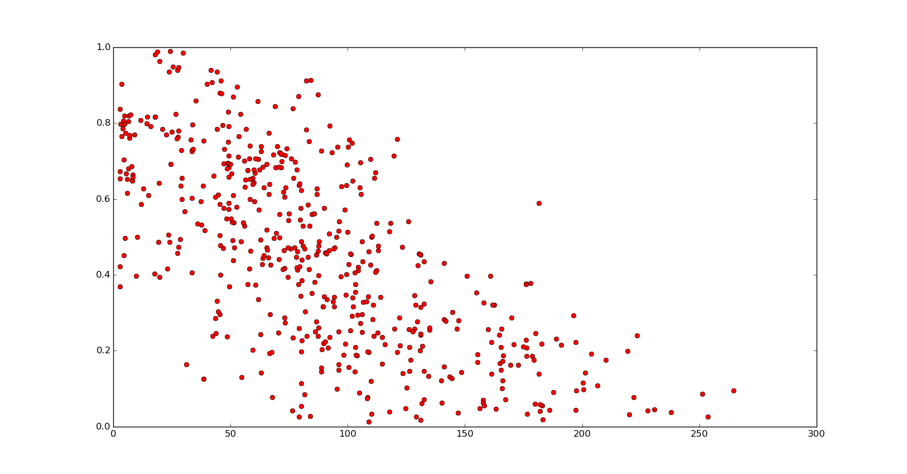

Figure 5.2. Probability of finding an archeological artifact (Y axis) is related to the `distB` (X axis). Probability grows as the distance to the closest historical building decreases. This conclusion coincides with what was observed in figure 3.8 (which was based on the training data).

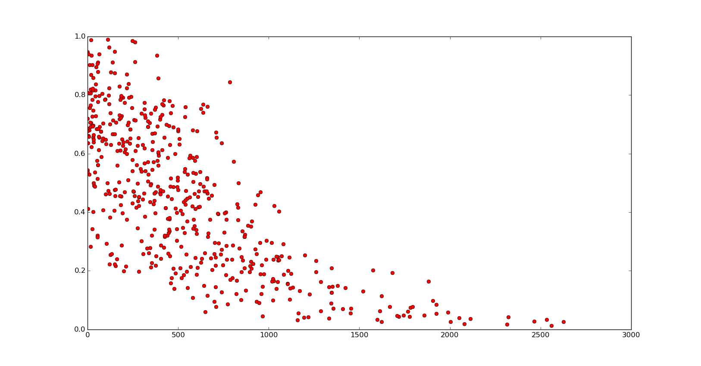

Figure 5.3. This charts shows how probability of finding an archeological artifact (Y axis) is related to the `distP` (X axis). Here, correlation is not so easily observed but it still can be notes that there are more instances with low `distP` and high probability, which is the exact conclusion of figure 3.10.

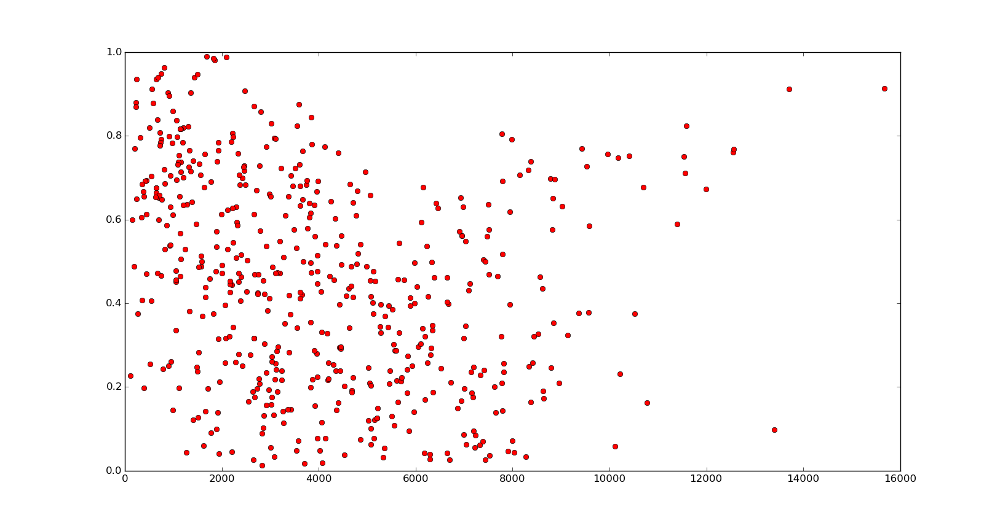

Figure 5.4. This charts shows how probability of finding an archeological artifact (Y axis) is related to the `distM` (X axis). Here, correlation is difficult to observe, which is similar to the figure 3.9.

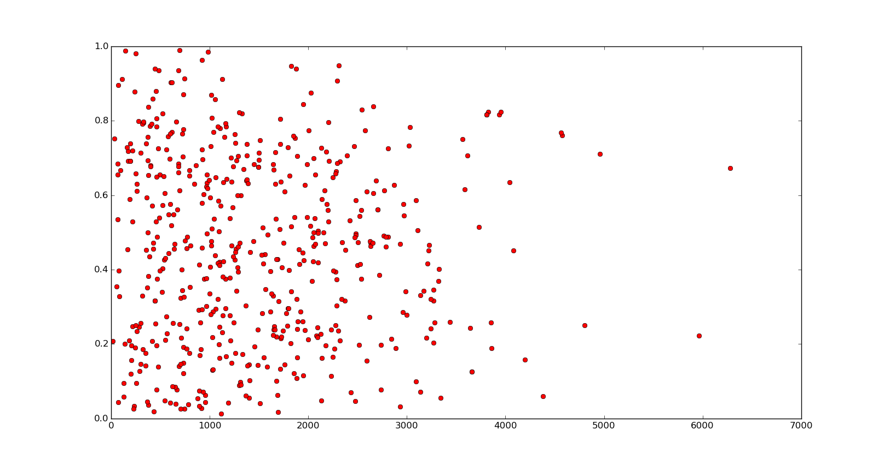

Figure 5.5. This charts shows how probability of finding an archeological artifact (Y axis) is related to the `countP` (X axis). Clearly many parks nearby is closely related to high probability of finding something (which was shown in figure 3.11).

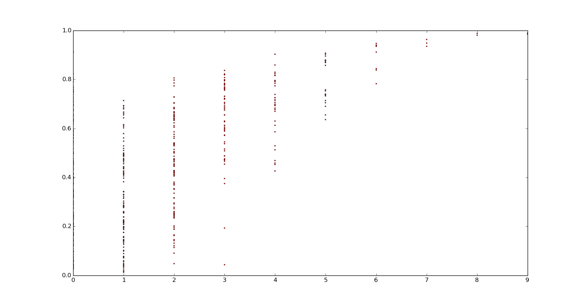

### 6 Summary
