# COMP 530 Big Data Project
####Final Report

### 1 Introduction

This project is intended to help inform of the likelihood of the archeological discovery anywhere in England. It can be used by planners wishing to lower the risk involved with discovering archeological sites and those looking for a specific place of value.

The aims of the project involve allowing a stakeholder to visualise likely locations where archaeological artefacts may be discovered. This may reduce the risks, time and costs involved in the discovery of archaeological sites.

Definitions:

- An __artefact__ is "something made or given shape by man, such as a tool or a work of art, especially an object of archaeological interest"; an artefact is an object recovered by archaeological endeavour

- __Archaeology__ is the "study of human activity in the past, primarily through the recovery and analysis of the material culture and environmental data that has been left behind by past human populations"

#### 1.2 Available data sets

Several data sets were used in this project. Heights over sea level are taken from OS Terrain 50 data set (in which distance between points is 50 meters). Locations of monuments, historical buildings and parks come from English Heritage whereas known archeological sites were taken from York Archaeological Data Service.

During the implementation, a problem arised with the York data set (ie., known sites). Most of the 100 km squares had lots of points clustered in the bottom left corner. Examples are shown below (Fig 1.1, 1.2).

Figure 1.1. Visualisation of the known archeological sites in the SP square. As the reason for so many points in the bottom left corner is unknown, the points were removed.

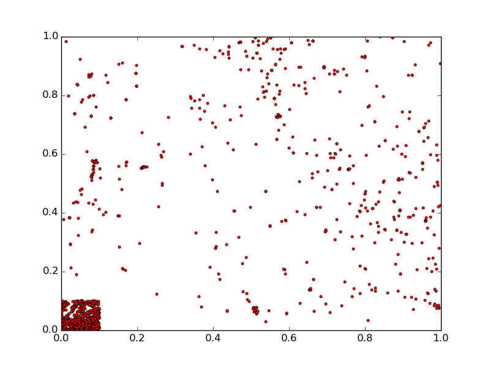
Figure 1.2. Visualisation of the known archeological sites in the SU square (roughly Hampshire county). The situation here is very similar to the one in Fig 1.1.
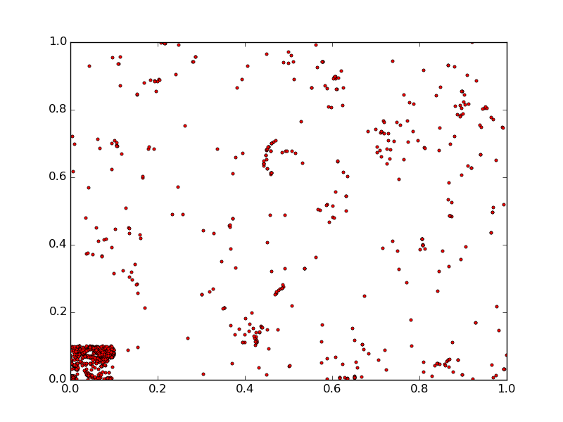

Another major issue related to this data set was to obtain "negative" instances. The York data set includes only positive instances. As the regression algorithms expect to receive instanced marked as 1 or 0, the negative data set was created.

The idea behind this was to come up with points that are furthest away from known sites. After this has been done, the graphs were plotted (they are shown in the section 3) to check whether newly produced instances are valid. After observing those results on graphs, it seemed that the idea seems viable. The graphs which present the obtained data are visible in Fig 1.3 and 1.4.

Figure 1.3. Visualisation of the known archeological sites in the SU square (roughly Hampshire county). Note lack of points in the bottom left corner (which were removed, as described above).
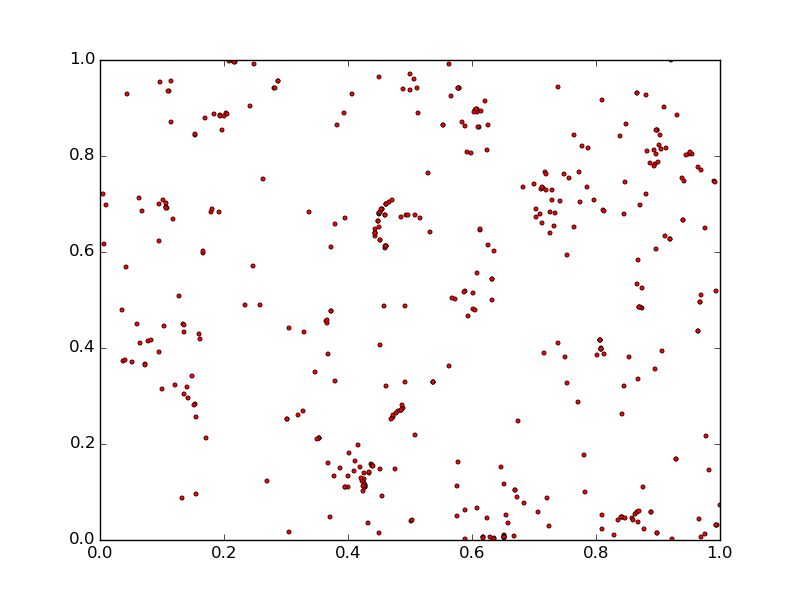

Figure 1.4. Visualisation of the known archeological sites (red) and places that are deemed to lack those sites in the SU square (green). Green points largely cover empty space away from red points (cf. Fig 1.3).
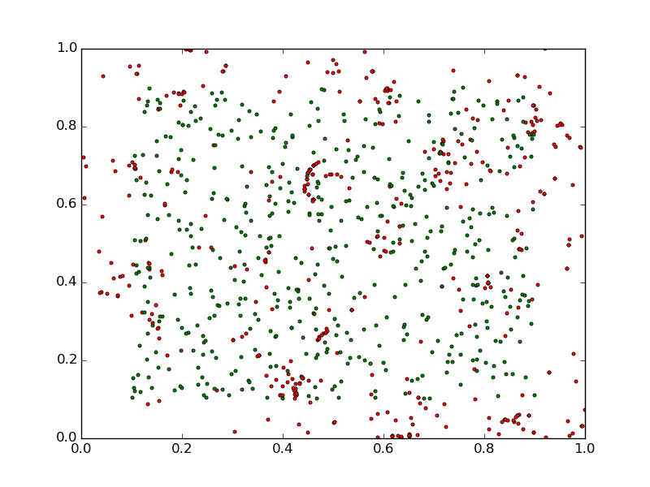

#### 1.3 Technologies used

Several different technologies were used to create the system described in this document.
The application consists of several essential parts. All available data is loaded into the Java application for preprocessing. Also, data warehouse structure in Big Insights has been used for data storage. Java application is also used to generate training and test sets. Then, the training set is used to train statistical model built with Python. Test sets produced beforehand are then loaded into Python program to compute probabilities. After all of this is done, the final data sets (which include probabilities now) are loaded into a visualisation website created with Python, HTML and JavaScript. The flow of the application is presented in Figure 1.1.

Figure 1.5. Diagram of the whole system.

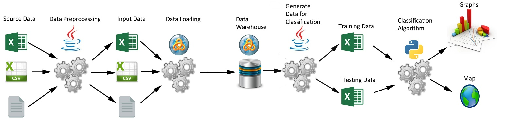

Additionally, there are several libraries and modules which were used in different parts of the application. They are listed in Table 1.1.

Table 1.1. A list of libraries used in this project.

|Name|Description|
|----|-----------|
|JUnit|This Java library has been used to write various unit tests of crucial parts of the system. Link: http://junit.org/|
|Pandas|It is a Python library which makes it easier to work with different data sets. It consists of data types which help manipulate the data, and functions which ease the process of loading and saving files. Link: http://pandas.pydata.org/|
|Statsmodels|It is a Python module which consists of a number of statistical models. Logistic regression, among others that were tried, is included in this library. Link: http://statsmodels.sourceforge.net/|
|matplotlib|This Python library was used to plot graphs, used in this document for visualisation purposes and during the development for observing trends and checking if the model is working. Link: http://matplotlib.org/|
|Flask|This small Python web framework was used to create a visualisation website. Link: http://flask.pocoo.org/|
|Leaflet|JavaScript library was used to enable viewing results on the map. The actual map data comes from OpenStreeMap project. Link: http://leafletjs.com/|

#### 1.4 Testing application

During development, it is obviously quite easy to make errors that may be difficult to spot. That may also make the process of development significantly longer, as developers need to take time to debug possibly well-hidden and not so obvious mistakes. That is why during the development stage, test driven development approach (TDD) was used to create crucial parts of the system, those where any mistake is very costly. So according to the principles of the TDD, developer first creates a test function (which tests a feature that will be implemented later). That approach, although possibly makes development longer, can help avoid serious problems and in the end helps create software with fewer errors. All unit tests were created with the JUnit library for Java and are listed in the Table 1.2.

Table 1.2. A list of created unit tests.

|Name|Description|
|----|-----------|
|`testLoading()`|Tests whether all data sets were correctly loaded. The test is performed by checking whether correct number of items is available in the application after the loading phase.|
|`testLanLonConverter()`|Checks whether Grid Reference points are correctly converted to latitude and longitude. Test is performed by comparing known values of latitude and longitude to the converted ones.|
|`testNGR()`|Tests whether National Grid Reference notation is correctly understood by the application. Each NGR value should be divided into three parts: two-letter square symbol and two five-digits numbers.|
|`testOS()`|This tests whether available data concerning the height over the sea level is correctly loaded, by checking if the number of values are correct.|
|`testOSData()`|That's additional check for the height data. It tests whether all squares on the map have data needed.|
|`testOSMetadata()`|Another test for the height data. It tests whether metadata (ie., number of rows/columns, position on the map etc.) for each square on the map is available.|
|`testOSCoordinates()`|It tests whether location obtained from the height data works correctly. It does so by trying to compare few points from the square to the known values.|
|`testFillZeroes()`|Some values used for location need to be filled with zeros at the beginning. This unit test checks if it is done correctly.|
|`testSquareSymbols()`|This test checks if conversion between 10 km squares and location values (which can be in range 0 - 99999) works. |
|`testMinDistances()`|Tests if a function which searches for the closest monument or other landmark does so correctly.|
|`testHeightEastingNorthing()`|Checks whether location of height values is correctly identified.|

### 2 Data

In th created system, data can be stored both using Java classes and Hive.

To store in Hive it was decided to follow a traditional data warehouse approach. The main purpose for following this approach is to enable future extensions to this project and to include some BI reporting features using the existing data and storage structure and to incorporate new data. First, all the data is loaded in the data staging area which is exact replica of the data files but in a table structure. The main purpose of designing a data staging area is to ensure that only selected and clean data is loaded in the warehouse.
Before writing about application logic, below is the description of main dimensions and facts of the data warehouse that has been mainly used to generate training and testing data.

__Dimensions and Facts:__

I. `Main_Heritage_Dimension`:

This dimension is designed to store English Heritage data. Each record in a file is considered as a single historic event value. The structure of this dimension is as follows:

- `RecordID`:  Unique identifier for a record.
- `Name`:  Name of the record
- `RecordType`: This field determines the type of record, for example battlefield, structured monuments etc.
- `StartDate`: This determines the date in which the record is loaded in the warehouse.
- `EndDate`: A Special field, which determines the state of the record. If the end date is infinity, it determines the record is in a valid state, if it has some date value that is current date or date which already has been passed, it determines a new record with the updated value has been inserted to replace this record.

II. `NGRDetailDimension`:

This dimension is used to store York data set. The structure of this dimension is as follows:

- `rowID`: Unique identifier for a record.
- `NGRCode`: Is the tile code.
- `Easting`: Easting value of a point.
- `Northing`: Northing value of a point.
- `Easting_Offset`
- `Northing_Offset`
- `e`: Easting value concatenated with the easting offset.
- `n`: Northing value concatenated with northing offset.
- `Latitude`: Latitude value of the corresponding easting/northing value.
- `Longitude`: Longitude value of the corresponding easting/northing value.

III. `Main_Heritage_Facts`:

This table holds the values for a heritage records. The structure of the fact table is as follows:

- `FactID`:  Unique identifier for a fact.
- `NGRCode`: Ordnance Survey national grid reference of centroid
- `EventCode`: Is the foreign key of from Main_Heritage_Dimension through which the details of a record can be determined.
- `StartTime`: Date on which the record was included in the source records.
- `EndTime`: Date on which the record was last updated.
- `CaptaScale`: Scale at which the spatial representation of that record was captured.
- `Easting`: Centroid Easting
- `Northing`: Centroid Nothing
- `Latitude`: Latitude value of the corresponding easting/northing value
- `Longitude`: Longitude value of the corresponding easting/northing value
- `AREA_HA`: Area of the polygon in hectares

#### 2.1 Preparing training data

For the purpose of training the model, it was decided to take English Heritage data and York dataset and the corresponding height values of  points from OS Terrain 50 dataset. From the English Heritage three data sets were selected: monuments, parks and gardens and listed buildings. Each data point in the York set is checked against the records from other data sets. The record which is found to be closest to that data point is taken into account. Other features are counts that tell how many English Heritage records are withing 5 km radius of a given data point. The height value for each data point is taken from OS terrain data. All the values are stored in the `csv` files which are later used by the model for the training purposes.

#### 2.2 Generating test sets

Generation of test sets is a similar process to the one described above.

Data sets, such as OS Terrain 50 and English Heritage records are used to generate test sets for every 100 km square of the grid. Values needed for testing, such as number of monuments within 5 km, number of parks etc. are calculated and saved into a `csv` file. Also, easting, northing, height, latitude and longitude values are saved.

### 3 Analysis

Analytical part of the application was created in Python using several additional libraries mentioned in Table 1.1. Using Java application, the training set is created and saved as a `csv` file. It includes different features, some of which were used during training.

#### 3.1 Selecting features

Training set includes the following columns:

Table 3.1. Features available in the training set.

|Feature|Description|
|-------|-----------|
|`arch`|Denotes whether location is an actual archeological site (value 1) or not (0).|
|`height`|Height over the sea level (in meters). As it turns out, this feature has the largest impact on computing probabilities.|
|`distM`|Distance to the closest monument.|
|`distP`|Distance to the closest park.|
|`distB`|Distance to the closest historical building.|
|`countM`|Number of monuments within 5 kilometers.|
|`countP`|Number of parks within 5 kilometers.|
|`countB`|Number of historical buildings within 5 kilometers.|
|`e`|Location (using Grid Reference).|
|`n`|Location (using Grid Reference).|
|`lat`|Latitude|
|`lon`|Longitude|

For the actual analysis the following features were used: `height`, `distM`, `distP`, `distB` and `countP`. `countM` and `countB` were not used, because during tests it turned out that results obtained when using those two features gave worse values. Evaluation was conducted by dividing the training set into two parts. After the training stage (using the first half), the second half was used as a test set to compare obtained probabilities with actually known values. Problems with `countB` and `countM` might stem from the fact that the correlation between those two values and the `arch` (which denotes whether the location has an archeological site) was low. This was tested by plotting graphs of different variables to see their relationship visually.

In all graphs below, red colour denotes an actual archeological site, and green lack of thereof. The graphs were plotted using the training data.

##### 3.1.1. Correlation between `height` and features in the training set

Figure 3.1. Relationship between height (Y axis) and the `arch` variable in the training set (X axis). Clearly probability of finding an archeological artifact is inversely proportional to the height over sea level.

Figure 3.2. Relationship between `height` (Y axis) and `distB` (X axis). Clearly many green dots (no archeological sites) are further away from historical buildings than the red dots (archeological sites).

Figure 3.3. Relationship between `height` (Y axis) and `distM` (X axis). Many green dots (no archeological sites) are further away from monuments than the red dots (archeological sites).

Figure 3.4. Relationship between `height` (Y axis) and `distP` (X axis). Many green dots (no archeological sites) are further away from parks than the red dots (archeological sites).

Figure 3.5. Relationship between `height` (Y axis) and `countP` (X axis). More parks usually means larger probability of finding archeological sites (red dots). Often, places with no archeological sites have no parks nearby (ie. within 5 km).

Figure 3.6. Relationship between `height` (Y axis) and `countM` (X axis). Here correlation is not so easily seen. `countM` was eventually not used for the analysis.

Figure 3.7. Relationship between `height` (Y axis) and `countB` (X axis). Here correlation is not so easily seen. `countB` was eventually not used for the analysis.

##### 3.1.2. Features

Figure 3.8. `distB` feature (Y axis) in the training data (X axis). Clearly many archeological sites are close to historical buildings.

Figure 3.9. `distM` feature (Y axis) in the training data (X axis). More archeological sites are close to monuments, but the relationship is less noticeable.

Figure 3.10. `distP` feature (Y axis) in the training data (X axis). More archeological sites are close to parks, but the relationship is less noticeable.

Figure 3.11. `countP` feature (Y axis) in the training data (X axis). Archeological sites generally have many parks nearby.

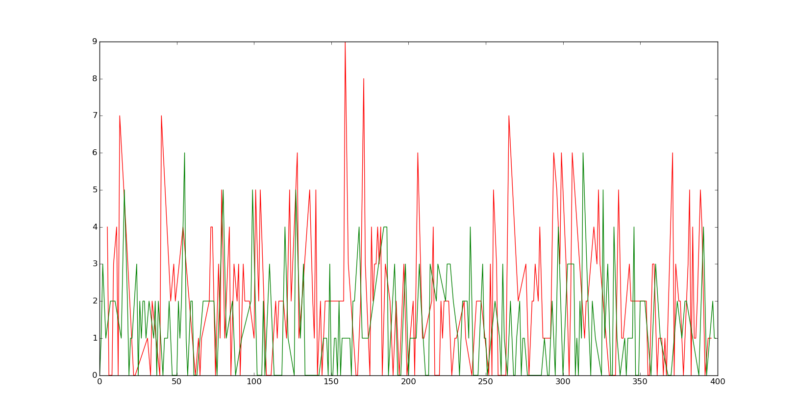

Figure 3.12. `countM` feature (Y axis) in the training data (X axis). Correlation difficult to spot. Feature was not used.

Figure 3.13. `countB` feature (Y axis) in the training data (X axis). Although clearly archeoalogical sites have more buildings nearby, but during the analysis using this feature only made the results worse and that's why it was not used.

#### 3.2 Testing algorithms

Statsmodels library, which was used for the analysis, includes several algorithms. Each algorithm was run with the training data (half of those used for training and half for evaluation). Using this technique, values of true positives (TP), true negatives (TN), false positives (FP) and false negatives (FN) were collected. Finally, the logistic regression was used as it proved to have the highest number of true positives and true negatives. Results of the tests are available in Table 3.2. In each test __529__ instances were used.

Table 3.2. Evaluating algorithms

|Algorithm|TP + TN|% of (TP + TN)|TP|TN|FP|FN|
|-----|-----|-----|-----|-----|-----|-----|
|Logistic regression|397|75%|165|232|59|73|
|Negative Binomial Regression|388|73%|155|233|58|81|
|Linear (OLS)|344|65%|116|228|63|119|
|Probit regression|396|74.9%|164|232|59|74|
|Poisson regression|388|73%|155|233|58|81|

### 4 Visualisation

The third part of the system is the visualisation website. As described in Table 1.1 it is based upon web framework called Flask and the front-end is made with Twitter Bootstrap and Leaflet.js (which made possible to use maps and draw on them). The idea behind this website is to let potential users easily browse the results. Because generation of the test sets for every point available (ie., every 50 meters) would take very long time, it was decided to select fewer points in order to speed up the process. So the visualisation may not be perfectly detailed, but as shown below, even though it's just an approximation, it still quite clearly shows where artifacts may be found.

A user has three options to choose from in the visualisation website. The system can show predicted values for the whole England (default), the training data and the training data drawn onto predicted values. Map can be easily zoomed in or zoomed out and moved around. Each point on the map can be clicked by the user and in the shown box, values of the features for that particular location will be shown.

#### 4.1 Screenshots

Figure 4.1. The default view of the website. It shows predicted values drawn onto the map. Red and orange points denote very large and large probability of finding artifacts, respectively. Green points denote small probability.  

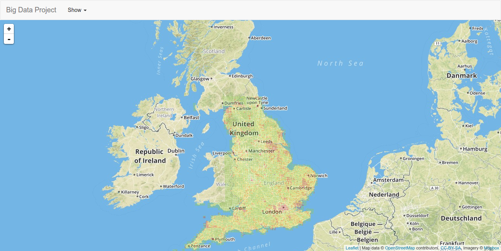

Figure 4.2. The area around Liverpool with points drawn. At the top, the menu is visible.

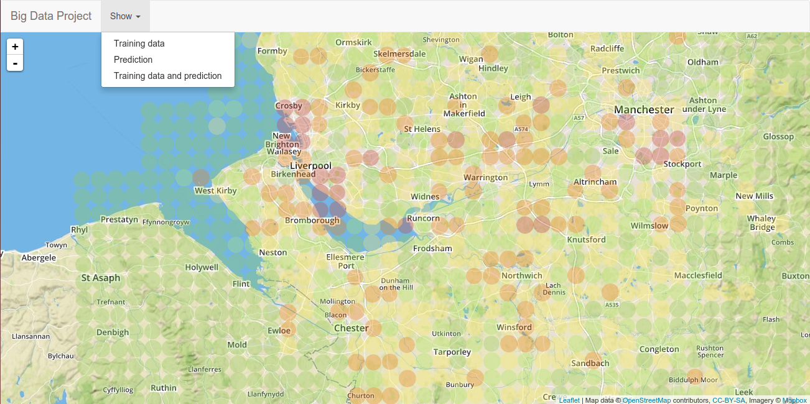

Figure 4.3. After clicking on any point, a box appears with values for that location.

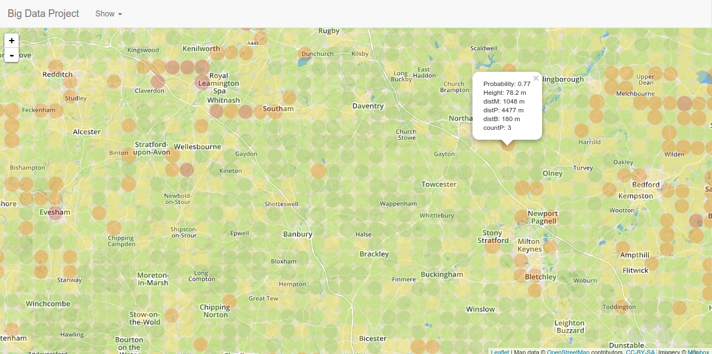

Figure 4.4. One of the conclusions that can be drawn is that artifacts are often close to each other, and that many of them appear in large cities. That can be compared to the area of London in the training set (cf. Fig. 4.5).

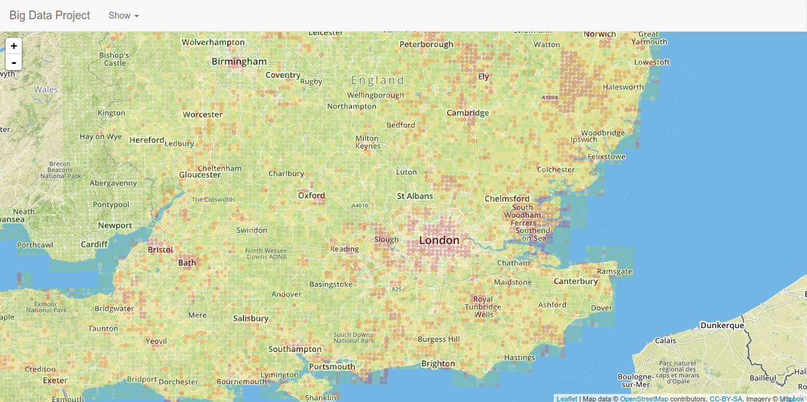

Figure 4.5. Training data for the TQ square which covers London. Unsurprisingly, many historical artifacts can be found near large cities.

Figure 4.6. Blue markers are instances from the training data. It can be noted that training instances usually coincide with the positive predicted values (red and orange circles), which is a desirable outcome.

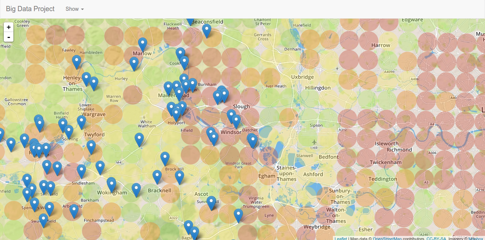

### 5 Observations

After running the analysis, the graphs were plotted again to see whether obtained probabilities correlate to the selected features from the training data (as was described in the section 3). The results are presented below.

Figure 5.1. Probability of finding an archeological artifact (Y axis) is clearly related to the `height` (X axis). Probability grows as height over sea level decreases. This conclusion coincides with what was observed in Figure 3.1 (which was based on the training data).

Figure 5.2. Probability of finding an archeological artifact (Y axis) is related to the `distB` (X axis). Probability grows as the distance to the closest historical building decreases. This conclusion coincides with what was observed in Figure 3.8 (which was based on the training data).

Figure 5.3. This chart shows how probability of finding an archeological artifact (Y axis) is related to the `distP` (X axis). Here, correlation is not so easily observed but it still can be noted that there are more instances with low `distP` and high probability, which is the conclusion of Figure 3.10.

Figure 5.4. This chart shows how probability of finding an archeological artifact (Y axis) is related to the `distM` (X axis). Here, correlation is difficult to observe, which is similar to the Figure 3.9.

Figure 5.5. This chart shows how probability of finding an archeological artifact (Y axis) is related to the `countP` (X axis). Clearly the existence of many parks nearby is closely related to high probability of finding something (which was shown in Figure 3.11).

### 6 Summary

As the aim of the project was to check whether it is possible to predict likelihood of the archeological findings using only open data, it can be concluded that such an endeavour is possible. Although there are many obstacles to deal with in this kind of project: from data issues such as errors and uncertainty of whether chosen algorithms and methods were valid to correctly using different coordination systems (visualisation needs latitude and longitude, but most of the available data sets offers locations in different format).

But as shown in this project, and described in this document, it is possible to obtain credible results, even though some of the techniques and technologies used here varied from the ones that were planned initially. One recommendation that may be in order after finishing the project is that it would be advisable to exploit more computing power. With that a bit more detailed results can be obtained.
